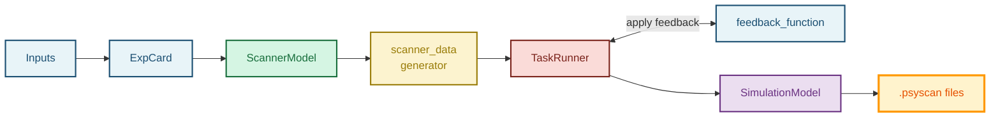
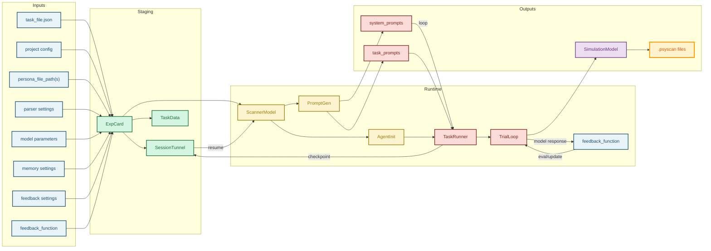
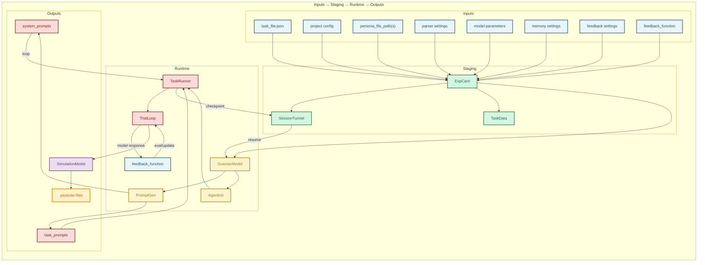
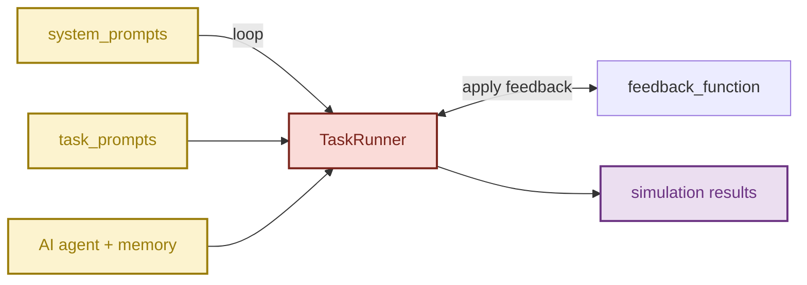
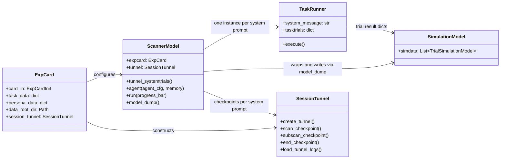

# PsychScanner Workflow

How a task card and a persona become a running session. The `ExpCard` is
the **experiment card** — the full specification of one experimental
session (model, task, memory architecture, persona conditioning), the same
role a pre-registration or session protocol plays in a human study. This
page traces what happens to it end to end, from your inputs to the trial
records written to disk.

## Slide 1 — High-level flow

- `ExpCard` is the central configuration object.
- It receives all external settings and drives the scanner lifecycle.
- The runtime chain is:
  1. Inputs → `ExpCard`
  2. `ExpCard` → `ScannerModel`
  3. `ScannerModel` → `TaskRunner`
  4. `TaskRunner` → outputs

## Slide 2 — Inputs and staging

- Inputs:
  - `task_file.json`
  - project config
  - `persona_file_path(s)`
  - parser settings
  - model parameters
  - memory settings
  - feedback settings
  - `feedback_function`
- `ExpCard` responsibilities:
  - validate and normalize inputs
  - load task and persona data
  - configure parser settings
  - create output directories
  - construct `SessionTunnel`

## Slide 2.5 — Detailed grid view (Horizontal Flow)

- This grid shows horizontal stage columns and vertical detail within each stage.
- `TaskRunner` receives the AI agent and memory chain from `AgentInitializer` and loops over both `system_prompts` and `task_prompts`.

## Slide 2.6 — Grid view with horizontal flow

- This horizontal flow grid shows the complete workflow progression from inputs through staging, runtime, and outputs.
- The layout emphasizes the linear flow of data through the system.

## Slide 3 — Runtime components

- `ScannerModel` turns `ExpCard` into actionable prompt data:
  - `system_prompts`
  - `task_prompts`
- `ScannerModel.agent()` creates the AI agent and memory chain (via `AgentInitializer` + `single_turn_convo_node()`).
- Each `TaskRunner` (one per system prompt) receives:
  - the AI agent with memory chain
  - one system prompt
  - `task_prompts`
- `TaskRunner.execute()` runs the trial loop and records results.

## Slide 4 — Loop behavior

## Slide 5 — Outputs and resume

- `TaskRunner.execute()` returns a list of per-trial result dicts; `ScannerModel.model_dump()` wraps them in `SimulationModel` / `TaskSimulationModel`.
- Outputs are saved as `*.psyscan` files.
- `SessionTunnel` logs checkpoints; `ScannerModel.tunnel_systemtrials()` uses them to compute a resume index.

> When tunnel mode is enabled, the workflow can restart from the last completed system prompt.

## Key stages

1. Input assembly
   - Persona file path(s), task JSON, model parameters, memory type, parser config, feedback config, and project/tunnel settings are provided.
   - All of these external inputs are encoded into `ExpCard` as the single experiment configuration object.
2. Experiment card creation
   - `ExpCard` validates inputs, loads task/persona data, configures parser settings, creates output directories, and constructs `SessionTunnel`.
3. Scanner model preparation
   - `ScannerModel` translates the experiment card into `scanner_data` and `task_prompts`.
4. Agent initialization
   - `ScannerModel.agent()` builds the LLM agent graph for the selected memory chain (`SingleTurn` or `Convo`) via `single_turn_convo_node()`, attaches it to an `AgentInitializer`, and that agent is passed into a `TaskRunner`.
5. Trial execution
   - `ScannerModel.run()` loops over system prompts, creating one `TaskRunner` per system prompt; each `TaskRunner` iterates its own task trials, invokes the agent, applies optional feedback, and collects trial outputs.
6. Output persistence
   - `ScannerModel.model_dump()` wraps the collected trial dicts in `SimulationModel` / `TaskSimulationModel` and writes `.psyscan` files; session checkpoints are logged separately via `SessionTunnel`.
7. Resume support
   - When tunnel mode is enabled, `ScannerModel.tunnel_systemtrials()` reads past logs via `SessionTunnel` and computes the resume index.

## Class Diagrams theme

### Alternative Workflow View - Class Diagram Style

Note: `ExpCard` and `TaskRunner` do the work described above inline in `__init__`/`execute` — they don't expose separate `validate_inputs()`/`run_trials()`-style methods. The method names above are the real public methods on each class.

Based on the architecture of PsychScanner compared to the Inspect framework from the UK AI Security Institute (AISI), there are several fundamental differences in their purpose, target domain, and core abstractions.

While both are frameworks that run Language Models through a pipeline of tasks, Inspect is a generalized machine learning benchmarking tool, whereas PsychScanner is a domain-specific framework tailored for simulating psychological experiments and cognitive behavioral paradigms.

Here is a breakdown of how they differ:

1. Core Focus & Domain
Inspect: Built to evaluate generalized capabilities and safety of large language models. It targets benchmarks like coding tasks, advanced reasoning, and agentic problem solving. It provides out-of-the-box support for taking standard AI benchmarks (like MMLU or SWE-bench) and evaluating models against them.
PsychScanner: Built explicitly to simulate human psychological behaviors across surveys and cognitive tasks. Its focus is on evaluating how an LLM acts when prompted with human-like personas and subjective items (like taking the VVIQ survey or ranking emotional relatedness).
2. Architecture & Abstractions
Inspect Models: Uses generic concepts like Datasets, Solvers (prompts/strategies applied to the model), Scorers (evaluating accuracy against a known target), and Tasks.
PsychScanner Models: Uses psychology experiment-based semantics. It relies on an ExpCard to configure experimental conditions, defines Persona data to assign subjective human traits to the model, and runs a TaskRunner (simulating experimental trials).
3. Memory & Trial Continuity
Inspect: Primarily evaluates interactions based on agent behavior and tool usages (like bash, Python, browser manipulation).
PsychScanner: Deeply focuses on stateful psychological persistence. It utilizes memory settings (`memory`: `SingleTurn` vs `Convo`) and a `feedback_fn` handler to monitor how a "participant's" beliefs, context, or fatigue might dynamically change from trial to trial across an experiment session.
4. Sandboxing vs. Logging
Inspect: Emphasizes heavily secure sandboxing (via Docker or Kubernetes) to safely execute untrusted code that an LLM generates during evaluation tasks.

PsychScanner: Doesn’t prioritize code execution infrastructure. Instead, it prioritizes the SessionTunnel which acts almost like a neurological/behavioral tracking log. It checkpoints cognitive processes, prompts, agent state, and creates .psyscan archives of simulated human-like responses.

Summary: If you wanted to test how well Claude or GPT-4 could write a Python script or navigate a website, you would use Inspect. If you wanted to simulate how a group of 50 anxious teenagers would rate their visualization capacity on a validated psychological questionnaire over 10 trials, you would use PsychScanner!