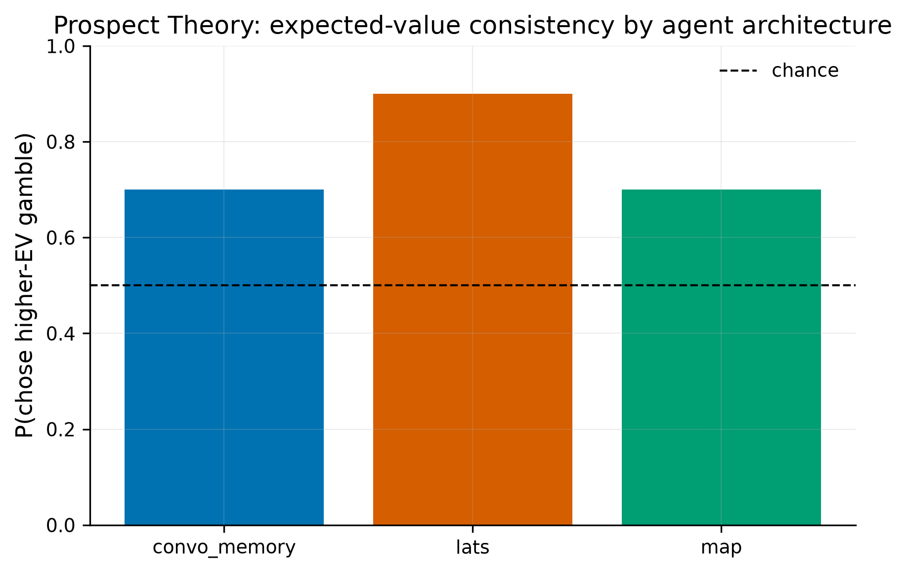

# Prospect Theory: MAP vs. conversation-memory vs. LATS

## Task

`examples/tasks/prospect_theory_demo.tcard.psyscan` (20 trials, built by
[`generators/generate_prospect_theory.py`](../../../tasks/generators/generate_prospect_theory.py)
per [musslick/experiment_factor_discovery](https://github.com/musslick/experiment_factor_discovery)'s
`benchmarks/prospect_theory.md` spec). Each trial presents two gambles
(Left/Right), each with a gain amount, a loss amount, and a gain
probability; the agent states which it prefers. This run used the first 10
of the 20 trials (see `simulation/run_prospect_theory.py`'s docstring for
why — bounding real API cost/time for a demo).

## Agents compared

| Agent | Source | Memory | Notes |
|---|---|---|---|
| `map` | `src/psychscanner/agents/map_agent.py` (new) | stateless per trial | Faithful implementation of Webb, Mondal & Momennejad (2025), *Nature Communications* 16:8633, "A brain-inspired agentic architecture to improve planning with LLMs" — 6 specialized LLM modules (TaskDecomposer, Actor, Monitor, Predictor, Evaluator, Orchestrator) in the paper's own control loop, scoped to single-shot binary choices (see the module's docstring for the scoping rationale). |
| `convo_memory` | bare `CustomAgent(model.invoke)` | `memory="Convo"` | Running dialogue of prior gambles/choices carried in the prompt each trial. |
| `lats` | `src/psychscanner/agents/reflection_agents.py` (pre-existing) | stateless per trial | Monte Carlo tree search over candidate answers — the pattern from LangChain's [reflection-agents](https://www.langchain.com/blog/reflection-agents) post. `max_iterations=1, branching=2`. |

All three ran against real Groq (`llama-3.1-8b-instant`) calls, no mocking —
`map_agent.py`'s own `demo()` and a full mock-llm `ScannerModel` dry run
(scripted fake model, all 3 agents through the actual `ExpCardInit` /
`ScannerModel` / `to_csv` pipeline) were verified first, per the project's
"mock before real" convention.

## Choice extraction

MAP's raw response is already a bare `left`/`right` (its Actor module is
instructed to reply with only that word, and `Search` returns the parsed
side directly). `convo_memory` and `lats` are a plain `model.invoke()` with
no such constraint, so llama-3.1-8b-instant answered in free-text
chain-of-thought instead of the one word the task instructions asked for
(e.g. *"Based on the expected values, the left option is likely to yield a
higher return."*). `analysis/analyze.py` extracts the *last* left/right
mention in the raw response — the same "parse the real signal back out of
free text" approach `01_reward_task/analysis/analyze.py` already uses for
`fb_response`. It's a proxy: on the one trial (`convo_memory`,
`prospect_01`) where the model never actually committed to an answer and
just noted "neither option seems very favorable," the heuristic picked up
an earlier incidental mention rather than a real decision. `summarize()`
reports a per-agent unparsed-response count (0 for all three here, i.e. every
response had at least one left/right mention) so this failure mode stays
visible rather than silently folded into the results.

## Results (10 trials each)

**Expected-value consistency** — chose the higher-EV gamble:

| Agent | P(chose higher-EV) |
|---|---|
| `map` | 0.70 |
| `convo_memory` | 0.70 |
| `lats` | **0.90** |

**Dominance trials** (6 of 10 — one gamble strictly better on gain, loss,
*and* probability): all three agents chose the dominant gamble 100% of the
time. No agent picked a strictly-worse-on-every-dimension option.

**Own choice-switch rate, by the ground truth's EV-transition label**
("switch" = the higher-EV side flipped from the previous trial; "repeat" =
it stayed the same):

| Agent | switch rate after "repeat" trials | switch rate after "switch" trials |
|---|---|---|
| `map` | 1.00 | 0.67 |
| `convo_memory` | 0.20 | 0.00 |
| `lats` | 0.40 | 1.00 |

`convo_memory` is the most *inertial* — it rarely changes its answer trial
to trial regardless of what the ground-truth EV structure actually does,
consistent with a running conversational transcript anchoring the model
toward its own earlier stated reasoning. `lats` tracks the ground-truth
transition structure best (switches almost exactly when the higher-EV side
actually changes). `map`'s switch rate is high in both conditions, which —
given its per-trial Evaluator score gap was often narrow in this small
sample — is also consistent with genuinely close calls rather than
insensitivity to trial structure; a larger run (the full 20 trials, or
repeated `nsim`) would be needed to tell those apart with any confidence.

## Caveats

- **n=10 trials, nsim=1, single model.** This is a demonstration of the
  pipeline and the three architectures working end-to-end on a real task,
  not a publishable behavioral claim — no repeated-measures statistics,
  one LLM, one temperature setting.
- **Choice-extraction proxy** for `convo_memory`/`lats`, described above.
- **MAP's scoping**: the paper's architecture is built for multi-step
  environments (Tower of Hanoi, graph traversal); this implementation uses
  its own degenerate single-decision case (`L=1`, `max_actions=1`) since
  Prospect Theory trials are single-shot and independent. See
  `map_agent.py`'s module docstring.
